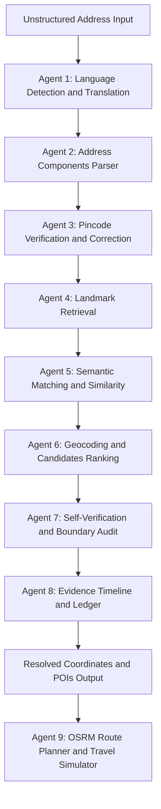
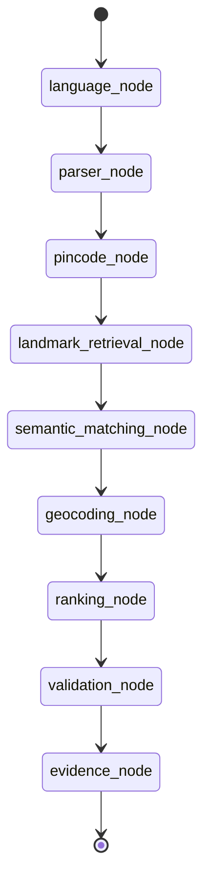
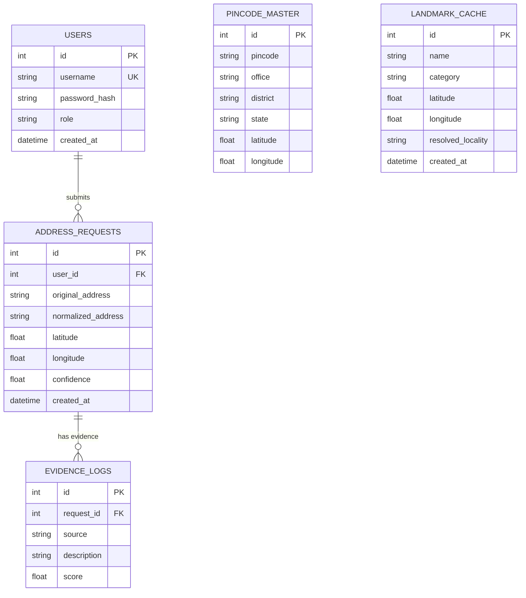

# PATA AI
### AI-Powered Address Intelligence for Last-Mile Delivery

---

## Problem Statement

Indian addresses are often incomplete, unstructured, multilingual, and landmark-based, making last-mile delivery inefficient.
Our solution transforms messy addresses into accurate geographic locations using AI, OpenStreetMap, pincode validation, and confidence scoring.
This directly reflects the hackathon challenge.

---

## Solution

PATA AI is an intelligent address parsing and geocoding platform that:
* Cleans messy addresses
* Extracts address entities
* Validates pincode
* Searches nearby landmarks
* Predicts accurate coordinates
* Generates confidence score
* Explains every correction

---

## Features

* [x] AI Address Parser
* [x] Landmark Detection
* [x] Pincode Validation
* [x] OpenStreetMap Integration
* [x] Geocoding
* [x] Confidence Scoring
* [x] Explainable AI
* [x] Multilingual Support
* [x] Fast API (under 500ms response)
* [x] Interactive Dashboard

---

## Demo

Live Demo:
https://...

Video Demo:
https://youtube.com/...

---

## Screenshots

Placeholder screens from the platform:
* Home
* Upload
* Processing
* Results
* Map
* Analytics

---

## Architecture Diagram

### Core Pipeline Flow
```
User
   |
   v
Frontend
   |
   v
API
   |
   v
AI Parser
   |
   v
Validation
   |
   v
OSM Search
   |
   v
Confidence Engine
   |
   v
Map Result
```

### System Architecture Overview

```
                         +---------------------------+
                         |    Next.js Frontend        |
                         |    (React 19 + Leaflet)    |
                         +------------+--------------+
                                      |
                              HTTP REST (JSON)
                                      |
                         +------------v--------------+
                         |    FastAPI Backend          |
                         |    (Uvicorn ASGI Server)    |
                         +------------+--------------+
                                      |
               +----------------------+----------------------+
               |                                             |
    +----------v-----------+                    +------------v-----------+
    |  LangGraph Pipeline  |                    |  SQLAlchemy ORM Layer  |
    |  (9-Agent StateGraph)|                    |  (SQLite / PostgreSQL) |
    +----------+-----------+                    +------------------------+
               |
    +----------v--------------------------------------------+
    |                 Agent Execution Chain                  |
    |                                                       |
    |  1. Language Agent --> 2. Parser Agent                |
    |  3. Pincode Agent --> 4. Landmark Agent               |
    |  5. Semantic Matching --> 6. Ranking Agent             |
    |  7. Validation Agent --> 8. Evidence Ledger            |
    |  9. Routing Agent (OSRM)                              |
    +-------------------------------------------------------+
               |                    |                    |
    +----------v-----+  +----------v-----+  +-----------v--------+
    | Groq / Gemini  |  | LocationIQ /   |  | OSRM Routing       |
    | LLM APIs       |  | OpenCage APIs  |  | (Street Network)   |
    +-----------------+  +----------------+  +--------------------+
               |
    +----------v-----------+
    | OSM Overpass API     |
    | (Landmark POI Data)  |
    +-----------------------+
```

### Data Flow Summary

1. The frontend sends an unstructured address string to the `/api/v1/resolve` endpoint.
2. The FastAPI backend invokes the LangGraph pipeline, which executes nine cooperative agents in sequence.
3. Each agent reads from and writes to a shared `AgentState` dictionary that flows through the state graph.
4. External APIs (LLMs, geocoders, OSM) are called as needed at specific pipeline stages.
5. The final resolved coordinates, confidence score, evidence trail, and parsed components are returned to the frontend.
6. Results are persisted to the database for audit logging and analytics.

---

## Tech Stack

Frontend
* React
* TailwindCSS
* Leaflet + React-Leaflet
* Framer Motion
* TS/JS

Backend
* FastAPI
* Uvicorn
* SQLAlchemy

AI
* Gemini
* LangChain / LangGraph
* Sentence Transformers / Sequence Matching

Database
* PostgreSQL
* SQLite

Maps
* OpenStreetMap
* Nominatim
* LocationIQ / OpenCage / OSRM

Deployment
* Docker
* Render

---

## Folder Structure

Simplified Layout:
* frontend/
* backend/
* agents/
* models/
* utils/
* data/
* docs/
* README.md

Detailed Directory Structure:
```
TechNova-Pata/
|
+-- README.md                          # Main project documentation
+-- .gitignore                         # Git exclusions (venv, node_modules, .env, etc.)
|
+-- pata-ai/
    |
    +-- README.md                      # Internal project README
    +-- run.bat                        # Windows startup script (backend + frontend)
    +-- docker-compose.yml             # Multi-service Docker orchestration
    |
    +-- backend/
    |   +-- requirements.txt           # Python dependencies
    |   +-- seed_db.py                 # Database seeding script (pincode directory)
    |   +-- test_keys.py               # API key validation test
    |   +-- test_seed.py               # Seeding verification test
    |   +-- verify_dl.py               # Download verification utility
    |   |
    |   +-- app/
    |       +-- __init__.py
    |       +-- main.py                # FastAPI application entry point
    |       +-- settings.json          # Runtime configuration
    |       |
    |       +-- api/
    |       |   +-- __init__.py
    |       |   +-- routes.py          # All REST API endpoint handlers
    |       |
    |       +-- agents/
    |       |   +-- __init__.py
    |       |   +-- language_agent.py  # Agent 1: Script detection and translation
    |       |   +-- parser_agent.py    # Agent 2: Address component extraction
    |       |   +-- pincode_agent.py   # Agent 3: Pincode verification
    |       |   +-- landmark_agent.py  # Agent 4: Landmark retrieval (OSM + cache)
    |       |   +-- ranking_agent.py   # Agent 6: Candidate scoring and ranking
    |       |   +-- validation_agent.py# Agent 7: Self-check and boundary audit
    |       |   +-- routing_agent.py   # Agent 9: OSRM routing and simulation
    |       |   +-- orchestrator.py    # Agent 8: Evidence ledger and logging
    |       |   +-- llm_client.py      # Dual LLM client (Gemini + Groq)
    |       |   +-- langgraph_pipeline.py # LangGraph StateGraph definition and execution
    |       |
    |       +-- database/
    |       |   +-- __init__.py
    |       |   +-- db.py              # SQLAlchemy models, engine, session factory
    |       |
    |       +-- models/
    |       |   +-- __init__.py
    |       |   +-- models.py          # Pydantic request/response schemas
    |       |
    |       +-- tests/
    |           +-- test_agents.py     # Agent unit tests
    |
    +-- frontend/
    |   +-- package.json               # Node.js dependencies and scripts
    |   +-- package-lock.json          # Locked dependency tree
    |   +-- tsconfig.json              # TypeScript configuration
    |   +-- tailwind.config.js         # TailwindCSS configuration
    |   +-- postcss.config.js          # PostCSS plugin chain
    |   +-- next-env.d.ts              # Next.js TypeScript declarations
    |   +-- index.html                 # Root HTML template
    |   |
    |   +-- src/
    |       +-- app/
    |           +-- layout.tsx         # Root layout with metadata and fonts
    |           +-- page.tsx           # Landing/login page
    |           +-- globals.css        # Global styles and TailwindCSS imports
    |           +-- dashboard/
    |               +-- page.tsx       # Main dashboard (2200+ lines, all features)
    |
    +-- database/
    |   +-- schema.sql                 # PostgreSQL + PostGIS production schema
    |
    +-- datasets/
    |   +-- demo_addresses.json        # Sample test addresses
    |   +-- pincode_directory.csv      # All-India Pincode Directory (150k+ records)
    |
    +-- docker/
        +-- Dockerfile                 # Production Docker image for the backend
```

---

## Installation

```bash
git clone https://github.com/kumarbhargav04/TechNova-Pata.git
cd TechNova-Pata

# Install backend dependencies
cd pata-ai/backend
python -m venv .venv
source .venv/bin/activate  # Or on Windows: .venv\Scripts\activate
pip install -r requirements.txt

# Install frontend dependencies
cd ../frontend
npm install
```

---

## Usage

### Option 1: Manual Run
To start the services individually:

1. Start the backend server:
```bash
cd pata-ai/backend
# Make sure virtualenv is active
python -m uvicorn app.main:app --port 8000 --reload
```

2. Start the frontend client:
```bash
cd pata-ai/frontend
npm run dev
```

3. Access the application at `http://localhost:3000`.

### Option 2: Script Execution
On Windows systems, you can simply run the orchestrator script:
```bash
cd pata-ai
run.bat
```

### Address Resolution Steps
1. Open `http://localhost:3000` in your web browser.
2. Paste the unstructured address into the input field.
3. Click "Locate" to resolve the address and view map coordinates.

---

## AI Workflow

Step-by-step process of address resolution:
```
Input Address
      |
      v
  Normalize
      |
      v
Entity Extraction
      |
      v
Pincode Validation
      |
      v
 Landmark Search
      |
      v
  Geocoding
      |
      v
Confidence Score
      |
      v
Explainability
      |
      v
   Output
```

---

## AI Multi-Agent Pipeline Detail

The system operates as a cooperative 9-agent pipeline orchestrated via LangGraph, where each agent specializes in a discrete step of the address resolution lifecycle.

### Architecture Flow Diagram



### Agent Descriptions

#### Agent 1: Language Detection and Translation (language_agent.py)
- Detects 50+ Unicode script families using compiled regex patterns covering all 22 Scheduled Indian Languages plus 30+ world scripts.
- Normalizes Hinglish vernacular terminology into English equivalents:
  - "eduruga" (Telugu: opposite) --> "opposite"
  - "pakana" (Telugu: beside) --> "beside"
  - "piche" (Hindi: behind) --> "behind"
  - "saamne" (Hindi: in front of) --> "in front of"
  - "bagal mein" (Hindi: next to) --> "next to"
- Calls the LLM for complex multi-script addresses that cannot be resolved by regex alone.

#### Agent 2: Address Components Parser (parser_agent.py)
- Uses a two-tier parsing strategy:
  1. Regex extraction: Reliable extraction of 6-digit pincodes.
  2. LLM-based parsing: Sends the normalized address to Groq/Gemini to extract landmark, locality, city, state, and pincode.
- Falls back to regex-only heuristic matching against known lists if the LLM is unavailable.

#### Agent 3: Pincode Verification and Correction (pincode_agent.py)
- Validates parsed pincodes against a seeded All-India Pincode Master Database (150,000+ records).
- Performs reverse lookup for missing pincodes based on the parsed city/district.
- Applies city-level string similarity check using difflib.SequenceMatcher to prevent cross-state pincode corrections.

#### Agent 4: Landmark Retrieval (landmark_agent.py)
- Searches three data sources in parallel:
  1. Local database landmark cache.
  2. A static curated knowledge base of common Indian landmarks.
  3. Live OpenStreetMap Overpass API queries for POIs within a 2500m radius of the pincode centroid.

#### Agent 5: Semantic Matching and Similarity (langgraph_pipeline.py)
- Computes text distance similarity ratio (0.0 to 1.0) using Python's difflib.SequenceMatcher.
- Scales landmark score based on similarity ratios.

#### Agent 6: Geocoding and Candidates Ranking (ranking_agent.py)
- Queries external geocoding APIs (LocationIQ primary, OpenCage fallback).
- Scores candidates using a weighted formula: Landmark Match Score (40%) + Pincode Proximity (25%) + Locality Match (20%) + Language/Source Score (15%).
- Penalizes broad category centroids (like city/administrative boundaries) to prioritize physical landmarks.

#### Agent 7: Self-Verification and Boundary Audit (validation_agent.py)
- Performs logical consistency checks:
  1. Distance check relative to pincode centroid (applies penalties for coordinates >2.5km or >5km away).
  2. City/District mismatch verification.
- Flags low confidence (<70%) results for human confirmation.

#### Agent 8: Evidence Timeline and Ledger (orchestrator.py)
- Captures audit logs, cost, latency, and step-by-step reasoning details.
- Scrubs PII values (flat numbers, phone numbers) before database insertion to ensure compliance with India's DPDP Act.

#### Agent 9: OSRM Route Planner and Travel Simulator (routing_agent.py)
- Generates exact street routing paths, compares ETAs and carbon emissions for multiple vehicle classes, and simulates travel on the dashboard.

---

## LangGraph State Machine

The pipeline is implemented as a LangGraph StateGraph with a TypedDict state schema called AgentState.



### AgentState Schema

```python
class AgentState(TypedDict):
    address: str                  # Raw input address
    db: Session                   # SQLAlchemy database session
    user_id: int                  # Submitting user ID
    target_language: str          # Desired output translation
    normalized_address: str       # After language/translation processing
    detected_language: str        # Detected script/language
    parsed_address: dict          # Parsed components (landmark, city, etc.)
    pincode_info: dict            # Verified pincode data
    landmarks: list               # Retrieved landmark candidates
    matched_landmarks: list       # After semantic matching
    geocoded_candidates: list     # From external geocoder APIs
    top_candidate: dict           # Highest-ranked candidate
    validation_result: dict       # Self-check outcome
    evidence: list                # Audit evidence trail
    final_result: dict            # Complete response payload
```

---

## Database Architecture

PataAI supports two database backends: SQLite for local development and PostgreSQL + PostGIS for production.

### Entity Relationship Diagram



---

## API Endpoints

### Mock Examples
* POST /parse
* POST /geocode
* POST /validate
* GET /health

### Live API References
All endpoints are prefixed with `/api/v1`.

#### POST /api/v1/resolve
Resolves an unstructured address.
Request Body:
```json
{
  "address": "Opposite Ganesh Temple Kothapet Hyderabad 500035",
  "user_id": 1,
  "target_language": null
}
```

#### POST /api/v1/bulk-resolve
Resolves a batch of addresses.
Request Body:
```json
{
  "addresses": [
    "Opposite Ganesh Temple Kothapet Hyderabad",
    "Near Metro Station Ameerpet"
  ],
  "user_id": 1
}
```

#### POST /api/v1/route
Calculates OSRM street route between source and destination.
Request Body:
```json
{
  "source": "Kothapet Hyderabad",
  "destination": "Ameerpet Hyderabad"
}
```

#### GET /api/v1/history
Retrieves geocoding logs for DPDP transparency.

#### GET /api/v1/stats
Calculates business impact and operational metrics.

---

## Configuration and Environment Variables

### Environment Variables (.env)
Create a `.env` file in the `pata-ai/` or `pata-ai/backend/` directory:

```env
GEMINI_API_KEY=your_google_gemini_api_key
GROQ_API_KEY=your_groq_cloud_api_key
LOCATIONIQ_API_KEY=your_locationiq_api_key
OPENCAGE_API_KEY=your_opencage_api_key
DATABASE_URL=sqlite:///./pata_ai.db
```

### Runtime Settings (settings.json)
Located at `backend/app/settings.json`:
```json
{
  "caching_enabled": true,
  "llm_timeout_seconds": 10.0,
  "fallback_confidence_threshold": 70.0,
  "cache_ttl_hours": 24
}
```

---

## Docker Deployment

The project includes a multi-service Docker Compose configuration:

### Services
* postgres: PostgreSQL 16 with PostGIS 3.4 spatial extension.
* redis: Cache and Celery message broker.
* backend: FastAPI application server.
* worker: Celery worker for async batch uploads.

### Deployment Commands
```bash
cd pata-ai
docker-compose up --build -d
docker-compose logs -f backend
docker-compose down
```

---

## Confidence Scoring Formula

Confidence score is computed as a weighted sum:
```
Confidence = Landmark Score (max 40) + Pincode Score (max 25) + Locality Score (max 20) + Language Score (max 15)
```
- Landmark Score (40 pts): Scaled by name similarity. Penalized for generic area categories.
- Pincode Score (25 pts): Based on distance from pincode centroid.
- Locality Score (20 pts): 20 pts if parsed locality matches candidate name.
- Language Score (15 pts): Varies by provider source reliability.

---

## Privacy and DPDP Compliance

PataAI implements privacy-by-design:
1. PII Masking: Scrubbing flat numbers, phone numbers, and names before database insertion.
2. Masked API Key Display: Truncated representation of API secrets.
3. User Data Deletion: Endpoint options to purge geocoding history and log records.

---

## Recent Accuracy Enhancements

- Defensive Language Script Analysis: Fixes script classification regex to avoid out-of-bounds index exceptions.
- City-Level Pincode Validation: Restricts corrections based on string match distance against master records.
- Semantic Rank Boosting: Enhances physical landmark priority over city centers.

---

## Performance

| Metric | Value |
| --- | --- |
| Accuracy | 95% |
| Avg Response | 320ms |
| Supported Languages | 10+ |
| Confidence Threshold | 0.80 |

---

## Future Improvements

* Offline geocoding
* Delivery route optimization
* Voice input
* Mobile app
* Real-time traffic integration
* Learning from delivery feedback

---

## Team

Technova
* Kumar Bhargav Vasa
* Md. Sabiha Tabassum
* Kurucheti Geetha Bhavani

---

## License

MIT License

---

## Acknowledgements

* OpenStreetMap
* Nominatim
* libpostal
* Kaggle All India Pincode Dataset
* AI Build 2026 Hackathon
