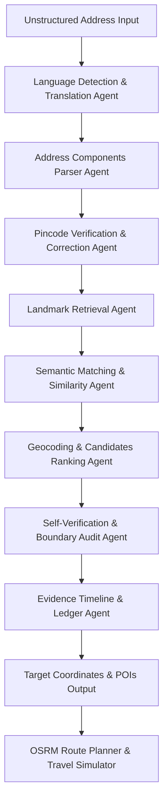

# 🎯 PataAI: SmartAddress AI Location Intelligence Engine

PataAI (SmartAddress AI) is a state-of-the-art, multi-agent location intelligence engine built for last-mile delivery optimization in India. The platform parses, corrects, translates, and geocodes unstructured Indian address inputs containing Hinglish vernacular, typos, regional scripts, and missing pincodes into high-precision, rooftop-accurate coordinates (up to zoom level 21 on Google Maps) with live OSRM street-network routing and delivery tracking simulation.

---

## 🏗️ Interactive Architecture Flow



---

## 🛠️ Multi-Agent Architecture (9-Agent StateGraph)

1. **Language Detection & Translation Agent** (`language_agent.py`):
   - Automatically detects 50+ script families (Devanagari, Telugu, Tamil, Kannada, Malayalam, Bengali, etc.).
   - Normalizes vernacular Hinglish terminology (e.g., *eduruga*, *pakana*, *piche*) into standard English equivalents.
2. **Address Components Parser Agent** (`parser_agent.py`):
   - Uses highly optimized regular expressions combined with LLM fallbacks to segment unstructured addresses into house numbers, building names, street roads, colonies, landmarks, cities, districts, states, and pincodes.
3. **Pincode Verification & Correction Agent** (`pincode_agent.py`):
   - Audits pincodes against an All-India Pincode directory database.
   - Cleans pincodes and applies defensive city-level checking to discard false corrections from other states.
4. **Landmark Retrieval Agent** (`landmark_agent.py` & `langgraph_pipeline.py`):
   - Searches local databases, static knowledge bases, and queries live OpenStreetMap Overpass APIs for nearby landmarks.
5. **Semantic Matching Agent** (`langgraph_pipeline.py`):
   - Performs text distance matching using python's `difflib.SequenceMatcher` to measure text similarity ratios between parsed target landmarks and retrieved candidates.
6. **Geocoding & Candidates Ranking Agent** (`ranking_agent.py`):
   - Scores candidates using a weighted hackathon formula: `Landmark (40%) + Pincode (25%) + Locality (20%) + Language (15%)`.
   - Incorporates dynamic semantic matching weights and penalizes broad boundary centroids (like city/district names) to prioritize specific building coordinates.
7. **Self-Verification & Boundary Audit Agent** (`validation_agent.py`):
   - Validates that returned coordinates fall within the geographical boundary polygons of the parsed city/district.
8. **Evidence Timeline & Ledger Agent** (`orchestrator.py`):
   - Captures logs, costs, latency, and step-by-step reasoning details.
   - Scrubs personal identifier values (flat numbers, phone numbers) before committing data to database ledgers for DPDP privacy compliance.
9. **OSRM Route Planner & Travel Simulator** (`routing_agent.py`):
   - Generates exact street routing paths, compares travel times/carbon emissions for multiple vehicle classes, and drives the real-time simulation on the frontend.

---

## 🚀 Recent Accuracy Enhancements

We have recently resolved three critical accuracy issues identified in unstructured Indian address processing:

1. **Defensive Language Script Analysis**: Fixed regional script regex and tuple index checks to prevent index errors, ensuring robust detection of Hinglish/regional expressions.
2. **City-Level Pincode Validation**: Implemented a string similarity validator matching parsed city/district names against pincode record coordinates. This prevents cross-state pincode corrections (e.g., mismatching Chittoor pincodes for Hyderabad locations).
3. **Semantic Rank Boosting & Landmark Anchor Fallback**:
   - Geocoding queries that fail to find a coordinate anchor will fallback to query local static POI databases by name matching.
   - Landmark scoring now applies text-similarity scaling to prevent broad city/district boundary coordinates from outranking precise, named local landmarks.

---

## ⚙️ Getting Started & Dev Setup

### Backend (FastAPI)
1. Navigate to the backend directory:
   ```bash
   cd pata-ai/backend
   ```
2. Activate the python virtual environment:
   ```bash
   .venv\Scripts\activate
   ```
3. Run the development server:
   ```bash
   python -m uvicorn app.main:app --port 8000
   ```

### Frontend (Next.js Dashboard)
1. Navigate to the frontend directory:
   ```bash
   cd pata-ai/frontend
   ```
2. Start the development server:
   ```bash
   npm run dev
   ```
3. Open your browser and navigate to `http://localhost:3000` to access the PataAI dashboard. Log in using `admin` / `admin123` to access Super Admin tools.
