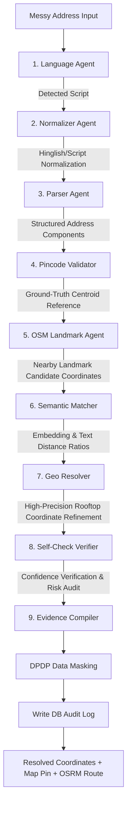

# PataAI 📍
### Enterprise AI-Powered Location Intelligence & Last-Mile Routing Engine for Indian E-Commerce

Built for the **AI BUILD Hackathon: E-Commerce in India (Student Edition)**. PataAI solves the last-mile delivery crisis in India caused by unstructured, messy, regional script, colloquial landmark references, and incorrect pincodes. 

---

## 📖 Project Overview

In India, address structures deviate drastically from Western formatting rules. They are unstructured, full of informal references, written in regional script transliterations, and contain common spelling typos and mismatched postal pincodes. Traditional geocoding platforms (such as Google Maps) fail or drop pins hundreds of meters away because they cannot parse colloquial land-references (e.g., "Opposite Ganesh Temple").

**PataAI** resolves this by introducing a **9-Agent Cooperative StateGraph** powered by LangGraph, Groq Llama-3, and Google Gemini. The engine normalizes regional vocabulary, parses addresses into structured schema, validates pincodes against ground-truth registries, queries OpenStreetMap (OSM) for landmark coordinates, refines geocodes, and simulates carbon-conscious routing options using Open Source Routing Machine (OSRM).

---

## 🏢 System Architecture

The following diagram illustrates how the frontend, backend, database layers, and external APIs interact to form the PataAI network:

```mermaid
graph TD
    subgraph Client Layer
        UI[Next.js React Dashboard]
        Voice[Speech-to-Text SpeechRecognition]
        Theme[Theme Controller Light/Dark]
    end

    subgraph Service Layer (FastAPI Backend)
        Router[API Router /routes.py]
        Graph[9-Agent Cooperative StateGraph /langgraph_pipeline.py]
        LLM[LLM Client Wrapper /llm_client.py]
        OSRM_Client[OSRM Routing Client /routing_agent.py]
    end

    subgraph Database Layer
        SQLite[(SQLite Database /pata_ai.db)]
        Pincodes[(Pincode Master Directory)]
        Cache[(Landmark Cache Table)]
        Audit[(DPDP Masked History Ledger)]
    end

    subgraph External Provider Layer
        OSM[OSM Overpass API]
        OSRM[OSRM Public Router]
        LocationIQ[LocationIQ Geocoding API]
        OpenCage[OpenCage Geocoding API]
        Groq_API[Groq API Llama 3.3]
        Gemini_API[Gemini API 1.5 Flash]
    end

    UI <-->|HTTP REST Requests| Router
    Router <--> Graph
    Graph <--> LLM
    Graph <--> OSRM_Client
    Graph <--> SQLite
    
    LLM <--> Groq_API
    LLM <--> Gemini_API
    OSRM_Client <--> OSRM
    Graph <--> LocationIQ
    Graph <--> OpenCage
    Graph <--> OSM
    
    SQLite --- Pincodes
    SQLite --- Cache
    SQLite --- Audit
```

---

## 🤖 The 9-Agent StateGraph Workflow

Addresses are processed through a sequential, cooperative graph where each node is represented by a specialized agent:



### Detail of the 9 Agents:
1. **Language Detection Agent**: Identifies scripts, text structure, and language boundaries (Telugu, Tamil, Hindi, Kannada, Hinglish).
2. **Script Normalization Agent**: Replaces colloquial descriptors with standardized English components (e.g., "daggara" -> "near", "opposite" abbreviations).
3. **Address Component Parser**: Performs token segregation, separating house number, landmark, street road, colony, city, state, and pincode.
4. **Pincode Validation Agent**: Cross-checks and automatically corrects mismatched or invalid pincodes using our SQLite database containing 150K+ official postal records.
5. **OSM Landmark Agent**: Executes live spatial bounding box queries to locate local references (hospitals, schools, temples) using the OpenStreetMap Overpass API.
6. **Semantic Matching Agent**: Calculates semantic distance ratios between parsed landmarks and candidates retrieved from geocoding queries.
7. **Geo Resolution Agent**: Triangulates coordinate outputs, calling LocationIQ or OpenCage as fallback APIs, and performs high-precision rooftop refinement.
8. **Self-Check Verifier**: Verifies coordinates lie within correct city boundaries and assigns a final geocoding Confidence Score.
9. **Evidence Compiler**: Generates a clean audit log and triggers data-compliance masking before database writing.

---

## 📂 File-by-File Directory Map

Below is the structured registry of primary source files in this workspace:

```
pata-ai/
├── run.bat                         # Automated environment builder and hot-reload launcher.
├── docker-compose.yml              # Multi-container orchestration configurations.
├── backend/
│   ├── run.py                      # Backend server local initialization script.
│   ├── seed_db.py                  # Downloads and seeds SQLite with 150,000+ official Indian pincodes.
│   └── app/
│       ├── __init__.py             # Python app module initialization.
│       ├── main.py                 # FastAPI system entrypoint, cors configs, and database seeding hook.
│       ├── settings.json           # Global configurations (caching toggles, timeouts, confidence thresholds).
│       ├── api/
│       │   ├── __init__.py
│       │   └── routes.py           # API endpoints (resolve, route planner, history delete, dynamic settings).
│       ├── database/
│       │   ├── __init__.py
│       │   └── db.py               # SQLAlchemy schema designs (User, AddressRequest, EvidenceLog, LandmarkCache).
│       ├── models/
│       │   ├── __init__.py
│       │   └── models.py           # Pydantic validation schemas.
│       └── agents/
│           ├── __init__.py
│           ├── langgraph_pipeline.py # Sequenced orchestrator running the 9-Agent StateGraph.
│           ├── llm_client.py       # Dual-LLM wrapper (Gemini 1.5 Flash + Groq Llama-3 API fallback).
│           ├── language_agent.py   # Code for script classification.
│           ├── parser_agent.py     # Segregates raw text components using structured LLM schemas.
│           ├── pincode_agent.py    # Matches postal numbers against database ground-truth.
│           ├── landmark_agent.py   # OSM Overpass client and Landmark Cache manager.
│           ├── ranking_agent.py    # Computes weights for candidate coordinates.
│           ├── validation_agent.py # Validates coordinate boundaries and formats.
│           └── routing_agent.py    # OSRM Router client (EV Truck, EV Scooter, Auto, Drone, Foot Courier).
└── frontend/
    ├── package.json                # Next.js workspace configurations.
    ├── tailwind.config.js          # Tailwind styling presets.
    ├── index.html                  # Fallback offline single-page HTML client console.
    └── src/
        └── app/
            ├── layout.tsx          # Main layout configuration with Leaflet styles.
            ├── globals.css         # Global stylesheets.
            └── dashboard/
                └── page.tsx        # High-fidelity dashboard application containing all workspace views.
```

---

## 💻 Dashboard Console Pages

The frontend workspace contains 8 primary workspaces:
1. **Single Address Geocoding**: Features real-time voice speech recognition, output translation into 15+ Indian languages, a Leaflet Map with accuracy overlays, and live Agent Logs showing Orchestrator state updates.
2. **Bulk Geocoding**: Parallel processing of large CSV address sheets. Outputs are exportable as geocoded CSV datasets.
3. **Route Planner**: Live OSRM street network routing plotting. Renders delivery path polylines, lists durations, tracks carbon emissions across 5 vehicles (EV Truck, EV Scooter, Auto, Drone, Walking Courier), and runs a simulated travel journey animation moving a custom vehicle icon step-by-step.
4. **Analytics Stats**: Displays total resolved drops, latency averages, confidence shares, and carbon reductions. Includes interactive SVG latencies distributions.
5. **Audit Ledger Ledger**: Review geocoding logs. Details include decision cost in INR/USD, exact parsed sub-components, and active model lists. Interactive trash icons trigger cascading database deletions.
6. **API Playground**: Live REST API tester simulating POST and GET requests. Outputs print structured JSON responses.
7. **API Keys Registry**: Generate and revoke active API tokens for third-party shipping integrations.
8. **Settings Panel**: Dynamic sliders and toggles for caching engines, LLM timeouts, and database resets.

---

## 👥 Authentication & Access

PataAI features a unified role access model:
- **Super Admin**: Logging in with credentials `admin` / `admin123` grants full access to the Settings Panel, database resetting tools, active model registries, and developer key management.
- **Regular Users**: Registering an account through the signup card automatically defaults user access privileges (role: `"Driver"` / `"Developer"`). Access is restricted to individual geocoding history, geocoders, routing simulations, and custom api key generations.

---

## 🚀 Setup & Launch Instructions

Double-click the **`run.bat`** file in the root directory. The script automatically orchestrates the following:
1. Verifies python is installed and creates a local virtual environment (`backend/.env`).
2. Installs requirements from `backend/requirements.txt`.
3. Seeds the local SQLite database with All-India postal records (`backend/seed_db.py`).
4. Launches the FastAPI backend on `http://localhost:8000`.
5. Compiles and launches the Next.js frontend dev server on `http://localhost:3000`.
6. Opens the app in your default browser automatically.
